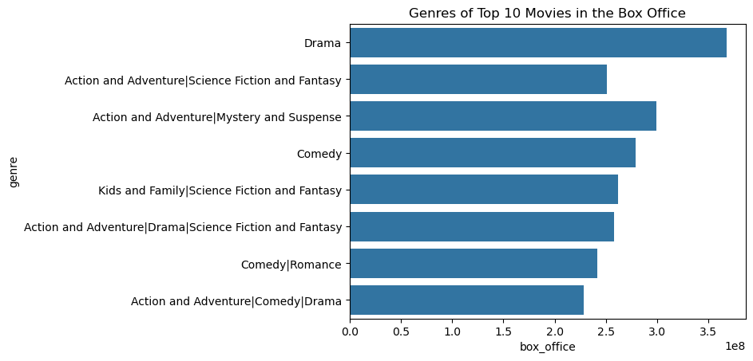
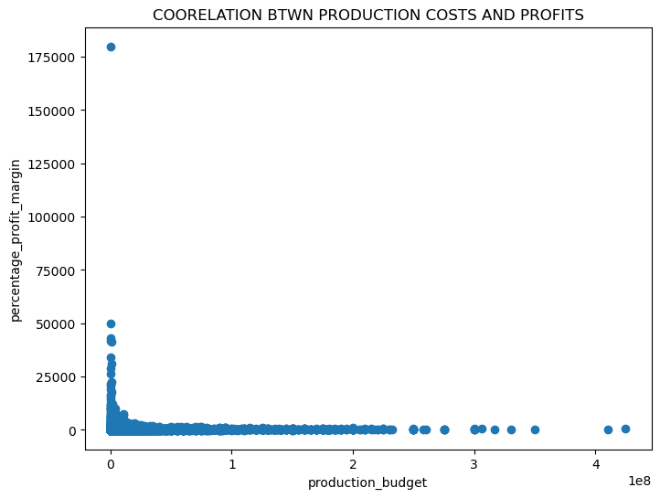
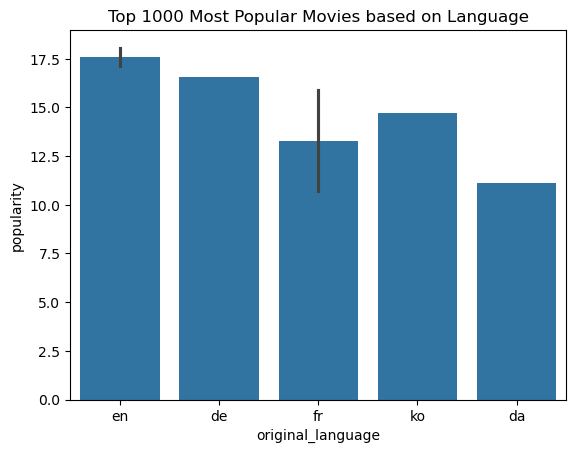
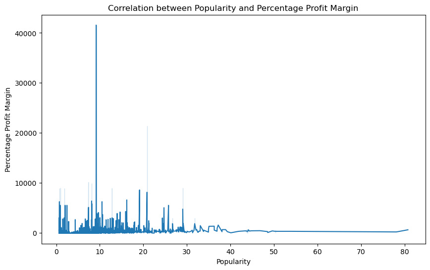

# Phase 1 Project Description

## Project Overview

The objective of this project is to analyze various datasets containing data on movies to provide Microsoft with three actionable recommendations for making movies. These recommendations will be based on comprehensive data analysis and insights derived from key metrics such as box office sales, genre, popularity and  profitability

# Business Problem

Microsoft sees all the big companies creating original video content and they want to get in on the fun. They have decided to create a new movie studio, but they don’t know anything about creating movies. You are charged with exploring what types of films are currently doing the best at the box office. You must then translate those findings into actionable insights that the head of Microsoft's new movie studio can use to help decide what type of films to create.

**BUSINESS UNDERSTANDING**

To provide Microsoft with strategic insights and recommendations for making successful and profitable movies based on comprehensive data analysis of various movie datasets.

**Key Questions:**

#What genres of movies are most likely to generate high box office revenue?

#What factors contribute profitability in the movie business ?

#How do audience voting preference  correlate with movie profitability and  popularity?

### The Data

In the folder DSCPHASE 1 I used  movie datasets from:

* bom.movie_gross.csv
* rt.movie_info.tsv
* tmdb.movies.csv
* tn.movie_budgets.csv

####  Data Understanding and Analysis

For this project, various datasets related to the movie industry have been collected. 

These datasets include: bom.movies, rt.movies, tmdb,movies, rt.movies  and tn.movies. 

These datasets contain  information on box office sales, movie genres, production budgets, movie directors, popularity,release dates and  audience ratings

 ####  Data Description

**Numerical Data:** Contains numerical values examples: box office revenues for movies, domestic and foreign  gross, vote count, popularity.

**Categorical Data:** Includes such as movie titles, genres, release dates, movie rating.

 ####  Approach

My Approach was to analyze various numerical data and review coorelation between the same and also analyse  categorical and numerical data to get insights on relevance of the categories.

####  Visualizations

####  Conclusions
1.  The stakeholders should consider Movie genres: Drama, Action and Adventure, Comedies, and  kids and family when choosing type of movies to produce as they have highest box office sales from our analysis.

2. The Production budget should be within $200,000,000 since production budgets beyond this amount don't have a strong                  coorelation to profitability.
3. Microsoft should take measures like sending reminder emails to ensures audience submit votes for their movies for their are likely to increase movie popularity and thus movie profitability.

4. Microsoft should liase with top directors to enable them produce movies with potential high box office sales.

   

[def]: image.png